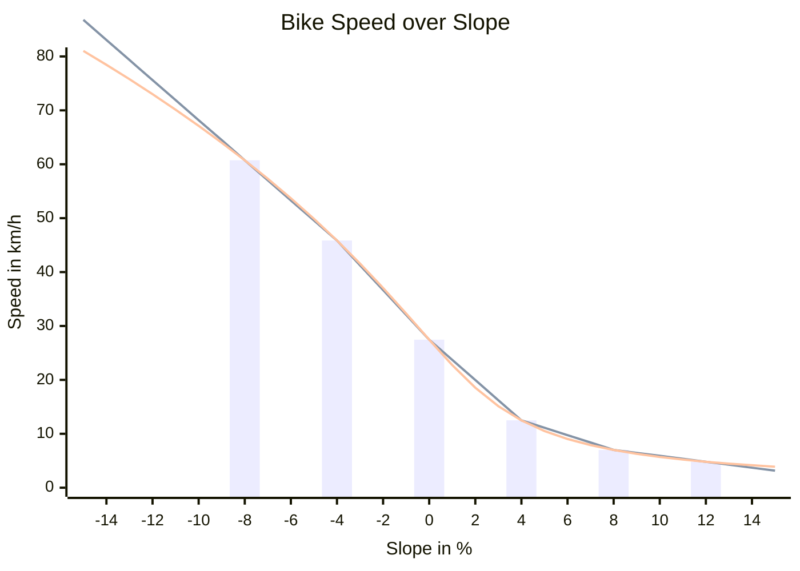

Longdistance Brouter Profile
================================================================================
Brouter V1.7.4 or newer is needed

A Brouter profile suited for bicycle long distance travels. It avoids bad 
surfaces, hills and high traffic.

ToDo
--------------------------------------------------------------------------------
- rework speed limit to include new possibilities

--------------------------------------------------------------------------------

This documentation tries to explain the profile in a bit more detail while 
maintaining the structure of the profile.

Credits
-------
Written by

* [Simon Densborn](https://github.com/simdens/brouter_profile)

The profile is initially inspired by:

- [default profiles of brouter](https://github.com/abrensch/brouter)
- [trekking profile by poutnikl](https://github.com/poutnikl/Brouter-profiles)

Coding Guidelines
================================================================================

Variable Naming
--------------------------------------------------------------------------------

| Example         | Description                            | Definition                                 |
|:----------------|:---------------------------------------|:-------------------------------------------|
|`broutervariable`| BRouter variable                       | as defined in `profile_developers_guide.md`|
|`UserParameter`  | UI adjustable parameter                | CamelCases starting with capital letter    |
|`gParameterValue`| Variable defined within global context | CamelCases starting with `g`               |
|`costValue`      | Variable within way or node context    | CamelCases starting with small letter      |

Global Context
================================================================================

UI Parameters
--------------------------------------------------------------------------------
Parameters which are adjustable within the UI of Brouter-Web.

### `Bike`
Parameter selects the bike and its terrain abilities.
Selectable bikes:

| # | Type     | Cat | Tire                            | Air Drag Area | Rolling Resistance |
|:-:| :------- |:-:| :-------------------------------------------------- | :----- | :------ |
| 1 | Roadbike | 1 | Continental Grand Prix 5000 25mm Tube @5.5bar       | 0.50m² | 0.00363 |
| 2 | Gravel   | 2 | Schwalbe G One RS 40mm Tube @3.1bar                 | 0.50m² | 0.00531 |
| 3 | Tour     | 1 | Schwalbe Marathon Plus 37mm Tube @4.0bar            | 0.65m² | 0.00764 |
| 4 | MTB      | 3 | Continental Cross King Protection 58mm Tube @2.4bar | 0.57m² | 0.00893 |
| 5 | Winter   | 1 | Schwalbe Marathon Winter Plus 42mm Tube @2.0bar     | 0.65m² | 0.012   |

Bike Categories are defined according to ASTM Classifikation ASTM F2043-13:

| Category | Type         | Drop Height |
| :------: | :----------- | :---------- |
| 1        | Roadbike     | 0cm         |
| 2        | Gravel       | <15cm       |
| 3        | MTB XC       | <60cm       |
| 4        | MTB Enduro   | <120cm      |
| 5        | MTB Downhill | >120cm      |

### `NominalPower`
Sets the continuous power capability of the biker and is used for computing the biking speed. 

### `SystemWeight`
Parameter used for bike speed calculation and elevation penalty computation.

### `SlopeMax`
Is the maximum allowed slope in uphill and downhill direction. Normally one has to dismount at this slope in uphill direction. If the slope is larger than this value, there will be an additional penalty.

### `TimeOptimalityPercentage`
Selects the focus of the routing. If this is 0%, routing will be done in a energy optimized manner. Using more energy will be penalized irrespective of the needed time. If this value is 100%, the most time efficient route is in favor irrespective of the needed energy.

### `TrafficVehicleCost`
Cost, in meter of perfect and flat street, for one vehicle overtaking the biker.

General Routing Parameters
--------------------------------------------------------------------------------
Parameters intended to be used for user adjustments but not directly available in Brouter-Web UI.

Constants 
--------------------------------------------------------------------------------
Constants not intended to be changed by the user.

Computed Constants
--------------------------------------------------------------------------------
Constants which are computed depending on the given parameters.

### Speed Parameter Calculation:
This section computes the bike speed for different slopes.
The formulas are based on the [kreuzotter calculator](http://www.kreuzotter.de/deutsch/speed.htm).

The balance of forces for a bike ride is
	$$P \eta = m a + v \left( F_r + F_g + F_v(v) + F_a(v^2) \right) $$
with 
biker power $P$,
efficiency of the mechanical power transmission $\eta$,
system mass $m$,
bike acceleration $a$,
current bike speed $v$,
rolling resistance force $F_r$,
gravitational force $F_g$ 
and the air resistance force $F_a$.
Target is to compute the constant bike speed for the current slope and surface.
Thus $a \overset{!}{=} 0$ is assumed.

#### Surface Angle $\beta$
The surface angle $\beta$ of the street can be computed by
$$\beta = \text{atan}\left( \frac{s}{100} \right)$$
with the slope $s$ in percent.
This can be linearized to
$$\beta \approx \frac{s}{100}.$$
For $|s| < 17\%$, the linearization error is less than $1\%$.

#### Rolling Resistance $F_r$
The rolling resistance $F_r$ is defined by
$$F_r = g m C_r \cos(\beta)$$
with 
the gravity of the earth $g$,
system mass $m$,
rolling resistance coefficient $C_r$
and the current inclination angle $\beta$ of the road.
For $|\beta| < 8\degree$ or $|s|<14\%$, this can be linearized to
$$F_r \approx g m C_r$$
with an error of less than 1%.
 
#### Gravitational Force $F_g$
$$F_g = g m \sin(\beta)$$
This can be linearized to
$$F_g = g m \frac{s}{100}$$
for $|s| < 14\%$ with an linearization error of less than 1%. 
 
### Air Resistance Force $F_a$
$$ F_a = \frac{1}{2} \rho A C_w v^2$$
 with the air densitiy \rho,
the cross sectional area $A$,
the drag coefficient $C_w$
and the current bike speed $v$.

This can be simplified to 
$$ F_a = \frac{1}{2} \rho A_e v^2$$
with the effective cross sectional area $ A_e = C_w A$.
 
 
#### Viscos Damping Force $F_v$
There might be an additional viscos damping (proportianal to the speed) which is estimated with an coefficient of $C_v = 0.1$, see  [kreuzotter](http://www.kreuzotter.de/deutsch/speed.htm).

$$ F_v = C_v v$$

#### Computing $v$
To compute $v$, the simplified terms for the forces are used. 
Since BRouter does not support the calculation of (square)roots, $v$ is computed by newthon's method for root finding.

The overall term is:
$$
	O
	\overset{1}{=}
	\underbrace{
		- P \eta 
		+ v g m \left( C_r + \frac{s}{100} \right)
		+ v^2 C_v
		+ v^3 \frac{1}{2} \rho A_e
	}_{=f(v)}
$$
For Newthon's method, the derivative
$$
	\frac{df(v)}{dv}
	=
	        g m \left( C_r + \frac{s}{100} \right)
	+ 2 v   C_v
	+ 3 v^2 \frac{1}{2} \rho A_e
$$
is additionally needed. 
 
Now it is possible to find a $v$ with $f(v) = 0$ by iteration steps of
$$
	v_{n+1}
	=
	v_n
	-
	\frac
		{f(v_n)}
		{\left.
			\frac{df(v)}{dv}
		\right|_{v=v_n}} 
.
$$
Practical tests showed that starting newtons method with a speed $v_0 = 20m/s$ will always reach a result with high accuracy after 5 iteration steps. 
Thus 5 iteration steps are used in the profile.

#### $v$ Interpolation Points
For performance reasons, Newthon's method for computing $v$ must only be used once in the global section.
In the way section, $v$ is estimated by linear interpolation between characteristic points. 
To find good characteristic points, the speed over slope diagram for an example setting is shown:

The used parameters are $A_e = 0,6005m^2$, $P = 165W$, $C_r = 0,00363$ and $m = 100kg$.
Interpolation points are plotted as bars, the resulting linear interpolation as grey line, while the correct speed is plotted as orange line.
For this example, interpolation points are chosen to be -8%, -4%, 0%, 4%, 8% and 12% slope. 
In general, interpolation points are chosen to have a distance of half `SlopeMax`or 4%, whichever is greater. 

### Push and Carry Cost Factors
For energy optimized routing, the cost for push and carry segments is scaled to somewhat represent tho worse energy efficiency of pushing or carrying compared to cycling. 
According to this [publication](https://dynamic-med.biomedcentral.com/counter/pdf/10.1186/1476-5918-8-4.pdf), "a human at 70kg requires about 60W to walk at 5 km/h on a firm and flat ground." 
The energy $E_p$ for pushing a bike for one km can be calculated by
$$
	E_p 
	= \frac{60\text{W}}{5\text{km/h}} + F_r \text{km}
	= (12 + C_r 54.5) \text{Wh/km}
	\approx 12.2 \text{Wh/km}
$$
for $C_r = 0.00363$.
The energy $E_c$ needed for 1km cycling a bike on a flat surface with the same rolling resistance can be computed by
$$
	E_c = \frac{P}{v_0}
$$
with the speed $v_0$ at a slope of 0%. 
The energy efficiency factor `gPushCostFactor` between pushing and cycling is the ration $E_p/E_c$.

For carrying, no values for the energy consumptions are available. 
Thus, the needed energy is guessed as three times the energy for pushing a bike.

### Elevation Cost Parameters

Cost for one meter in height is calculated by the equivalent distance which can be cycled with the same amount of energy.
Then, this cost is scaled depending on `timeOptimalityFactor`, which represents if the route has to be time or energy optimized.

The variable `height2Length`stores the factor to get the equivalent distance for one meter of height. 
It can be computed by
$$
	\text{height2Length} = \frac{m g}{\frac{P}{v}} =  \frac{m g v}{P}
	.
$$

### Constants depending on speed or elevation constants

#### `speedXCost`
`speedXCost` are constants, which store the costs to decelerate to lower speed and accelerate back again to cruising speed. 
The lower speed in km/h is indicated by the number `X`. 
For energy optimized routes, the costs are the way which can be traveled with the kinetic energy of the biker and the bike at cruising speed on flat terrain.
For time optimized routes, the cost is the way difference for deceleration and accelerating afterwards compared to continuous cruising speed.

The equivalent way / the cost for the energy optimized routes can be calculated by
$$
	\text{speedXCostEnergy} = \frac{v_0}{P} \left(\frac{1}{2} m v_0^2 -  \frac{1}{2} m v_x^2 \right)
	.
$$
$\frac{v_0}{P}$ is the way travelled with 1J of energy at nominal speed $v_0$.
This is scaled with the braked energy.

For the speed optimized route, the cost shall represent the way difference between deceleration and accelerating afterwards compared to continuous cruising speed. 
This calculation involves some more complex computation and thus is done offline.
For $v_0 = 26.3km/h$, $P=165W$, $m=100kg$ and $s = 0\%$, the result was, that the cost are roughly half of the cost for the energy optimized routing.
Even for some variance in the stated parameters, this estimation is still valid.
$$
	\text{speedXCostTime} = \frac{1}{2} \text{speedXCostEnergy}
$$

Taking `timeOptimalityFactor` into account, this results in an overall cost for decelerating to o speed of `x` of
$$
	\text{speedXCost}
	= 
	(1 - c_{tof}) \text{speedXCostEnergy}
	+
	c_{tof} \text{speedXCostTime}
$$
$$
	= (1 - \frac{1}{2} c_{tof}) \text{speedXCostEnergy}
$$
with $c_{tof} = \text{timeOptimalityFactor}$.

#### `initialPushCost`

Cost to dismount from bike:
For energy efficient cost, sum of:

- cost for standing still and accelerating (speed0CostEnergy) 
- cost for potential energy change due to lower centre of gravity of the biker (~15cm)

For time efficient cost, sum of:

- cost for stnanding still and accelerating (way difference to continuous travelling, speed0CostTime)
- cost for time needed to dismounting (2s for dismount + 2s for mount)

All together, this results in the formula:
$$
	\text{initialPushCost} 
	= 
	\text{speed0Cost}
	+
	(1 - c_{tof}) 0.15m \cdot \text{height2length}
	+
	4s \cdot c_{tof} v_0
$$

#### `initialFerryCost`

Cost to enter a ferry.
For energy efficient cost, sum of:

- cost for standing still and accelerating
- cost for potential energy change due to lower cog of the biker (~15cm)

For time efficient cost, sum of:

- cost for standing still and accelerating (way difference to continuous
  travelling)
- cost for time needed to dismounting (2s for dismount + 2s for mount)
- cost for waiting time (30min in average. One ferry every hour is assumed)

$$
	\text{initialFerryCost}
	=
	(1 - c_{tof}) \left(\text{speed0CostEnergy} + 0.15m \cdot \text{height2length} \right)
	+
	c_{tof} \left(\text{speed0CostEnergy} + 4s \cdot v_0 + 30min \cdot v_0 \right)
$$
$$
	= 
	\text{initialPushCost} 
	+
	c_{tof} \cdot 30min \cdot v_0
$$

### `trafficSignalCost`
For node cost, BRouter does not differentiate between surface slope angles. 
Thus, all cost are only calculated for flat surfaces. 

For Traffic lights, it is assumed that

- one traffic light cycle is 90s
- green light is 50% of the time

Thus, the red light time is 45s and the mean waiting time is $50\% \cdot 22.5s = 11.25s$, assuming a uniform distribution of arrivals at the traffic light. 
With a chance of 50%, the bike has to come to a full stop and accelerate to cruising speed afterwards. 
The cost for traffic signals can be computed by
$$
	\text{traffacSignalCost}
	=
	0.5 \cdot \text{speed0Cost}
	+
	c_{tof} \cdot 11.25s \cdot v_0
$$

Way Context
================================================================================

Logic Values
--------------------------------------------------------------------------------
Flags which are used at several positions later on. 

Surfaces - Rolling Resistance
--------------------------------------------------------------------------------
The rolling resistance for the current bike and surface is calculated. 
The rolling resistance is computed as a factor. 
Factor = 1 is the best possible rolling resistance: a perfect asphalt surface.
Every other surface is normalized with this perfect asphalt surface.

Rolling resistance coefficients are available for car tires, but not for so many for bike tires. 
Thus the strategy is

- get the normalized, with respect to perfect asphalt surface, rolling resistance for car tires
- scale that rolling resistance to the used bike tire.

### Rolling Resistance

An overview of rolling resistances for car tires according to different sources:

| [Surface](https://wiki.openstreetmap.org/wiki/Key:surface) | norm | used | [DE-Wikipedia](https://de.wikipedia.org/wiki/Rollwiderstand) | [Rhetos](https://www.rhetos.de/html/lex/rollwiderstandskoeffizienten.htm) | Comment |
|:--------------|:----:|:-----:|:-------------:|:-------------|:--------------------------------------|
| asphalt       |  1.0 | 0.010 | 0.011 - 0.015 | 0.011 - 0.03 | assuming good asphalt                 |
| concrete      |  1.1 | 0.011 | 0.01  - 0.02  | 0.01  - 0.02 | quite good concrete                   |
| metal         |  1.1 | 0.011 |               |0.008 - 0.009 | bit worse since it is slippery        |
| paving stones |  1.5 | 0.015 | 0.013[^KFT]   |              |                                       |
| compacted     |  1.8 | 0.018 |               |              | between paving stones and cobblestone |
| wood          |  1.8 | 0.018 |               |              | between paving stones and cobblestone. Most often on bridges with small gaps between the planks | 
| sett          |  2.0 | 0.020 |               |              | between paving stones and cobblestone |
| pebblestone   |  2.4 | 0.024 |               |              | between gravel and compacted          |
| copplestone   |  2.5 | 0.025 | 0.015 - 0.03  | 0.015 - 0.03 | bike tires are thin                   |
| grass paver   |  2.7 | 0.027 |               |              | even worse than cobblestone but better than gravel |
| gravel        |  3.0 | 0.030 | 0.02          | 0.02         | bike tires are thin                   |
| ground        |  3.4 | 0.034 |               |              | between compacted and dirt            |
| fine gravel   |  4.0 | 0.040 |               |              |                                       |
| dirt          |  5.0 | 0.050 | 0.050         | 0.0050       |                                       |
| sand          | 10.0 | 0.100 | 0.04 - 0.08   | 0.1 - 0.35   | bike tires are thin                   |
| mud           | 15.0 | 0.150 |               |              | really don't want to be there         |
| (potholes)    |      |       | 0.03 - 0.06   |              | asphalt with potholes                 |
| clay          |      |       |               |              | compacted                             |
| earth         |      |       |               |              | dirt                                  |
| grass         |      |       |               |              | dirt                                  |
| paved         |      |       |               |              | concrete                              |
| unpaved       |      |       |               |              | dirt                                  |

[^KFT]: Kraftfahrtechnisches Taschenbuch, page 418
[^paved]: Promeneuse7 (cobblestone) NataleeJo (asphalt), Mateusz Konieczny (paving stones), composed by Mateusz Konieczny, [CC BY-SA 3.0](https://creativecommons.org/licenses/by-sa/3.0), via Wikimedia Commons

The "used" column shows the used values for this profile.
The "norm" column is the normalized value relative to asphalt.

### Scaling with Respect to the used Tires
The rolling resistance values need to be scaled with respect to the used tires.
For a mountainbike, the difference between asphalt and gravel is much less than for a roadbike. 
To make the change in rolling resistance for car tires, see above, somewhat comparable to different bike tires, the resistance is normalized to the normal force per contact patch area.
If the normal force / mass stays the same, an increase in contact patch area will reduce increase in rolling resistance due to different surfaces - this is the MTB vs. Roadbike example. 

Mathematically, the normal force per contact patch area, or pressure $p_c$, can be calculated by
$$
	p_c = \frac{m g}{A_c}
$$
with the contact patch area $A_c$.
Since we do not know the contact patch area, it has to be estimated by
$$
	A_c \approx w \cdot l_c \approx w \cdot \frac{c_t}{p_t}
$$
with the tire width $w$ and the contact patch length $l_c$. 
The effective tire width is assumed to be known and assumed to be somewhat constant with respect to the tire air pressure $p_t$. 
The contact patch length $l_c$ is unknown.
This length is assumed to be anti-proportional to the tire air pressure $p_t$, i.e. with increasing air pressure, the contact patch length gets shorter. 
The proportionality coefficient is named $c_t$ and unknown. 

Since $g$ is constant and $c_t$ is assumed to be constant for all vehicle types, we can define a surface normalization factor, $snf$, by
$$
	snf = \frac{p_c}{g c_t} = \frac{m p_t}{w}
	.
$$
For a car, i.e. Golf V with $m_{car}=1600kg$, $400kg$ per wheel, tire width $w_{car} = 225mm$ and tire air pressure $p_{t,car} = 2.2bar$, the $snf$ is
$$
	snf_{car} \approx 4.293 \frac{\text{kg} \cdot \text{bar}}{\text{mm}}
$$
This can be used to calculate the increase of the surface factor compared to perfect asphalt for the used bike tire by
$$
	\text{surfaceFactor}_{bike} = 1 + \frac{snf_{Bike}}{snf_{car}} \left( \text{surfaceFactor}_{car} - 1 \right)
	.
$$

#### Touring Bike Example
For the example of a touring bike with $m_{touring} = 100kg$, $50kg$ per wheel, $w_{touring} = 37mm$ and the tire pressure $p_{t,touring} = 3.5bar$, the $snf_{touring} \approx 5.41 \frac{\text{kg} \cdot \text{bar}}{\text{mm}}.$ Resulting in a ratio of $\frac{snf_{touring}}{snf_{car}} \approx 1.102.$

Walking & Carrying Detection
--------------------------------------------------------------------------------
To detect if the bike needs to be pushed (⇒ *Walking*) or carried (⇒ *Walking* & *Carrying*), the bike category is compared to the estimation which bike category is needed.
Id est:
$$
	\text{isWalking} = \text{wayCategory} > \text{gBikeCategory}
$$
$$
	\text{isCarrying} = \text{wayCategory} > (\text{gBikeCategory} + 1)
$$
The $\text{isWalking}$ and $\text{isCarrying}$ flags are used later on.

Rolling Resistance Cost
--------------------------------------------------------------------------------
Computation of cost due to rolling resistance.
This cost is only used for energy optimized routes. 
For time optimized routes, the rolling resistance is included in the speed cost.

Speed Cost
--------------------------------------------------------------------------------
The biker speed depending on the slope and current rolling resistance coefficient is computed.
The speed is computed by linear interpolation between the interpolation points computed in the global context.
The speed cost is included for time optimized routes.

Traffic Cost
--------------------------------------------------------------------------------
For traffic cost calculation, the estimated number of overtaking vehicles per meter way length is computed and scaled by the traffic vehicle cost.
The traffic is estimated by using (German) statistics based on `highway` type and number of `lanes`, and by the Brouter-pseudo-tag `estimated_traffic_class`.
The mean of both estimations is used for cost calculation. 

To compute the cost, the number of overtaking vehicles is calculated with respect to the traffic speed and the biker speed. 

### Traffic based on `highway` type
In Germany, Baden-Württtemberg, the 2020 statistics for the DTV[^dtv] are available [online](https://mobidata-bw.de/vm/Endergebnisse_Strassenverkehrszaehlung_BW/Ergebnisse_2020_Excel.zip).
The condensed number of vehicles per day are:

| Highway Type                 | Overall | 2 Lane Streets | 3 Lane Streets | 4 Lane Streets | 6 Lane Streets |
|:-----------------------------|:-------:|:--------------:|:--------------:|:--------------:|:--------------:|
| *Autobahn*: Motorway / Trunk |   58540 |                |                |          24535 |          82296 |
| *Bundesstraße*: Primary      |   13821 |          11153 |          13314 |          28440 |          34845 |
| *Landstraße*: Secondary      |    5904 |           5676 |                |          19949 |                |
| *Kreisstraße*: Tertiary      |    2611 |           2562 |           3049 |           8527 |                |

[^dtv]: "Durchschnittliche tägliche Verkehrsmenge", average daily traffic on the street in summation over all lanes.

At least 10 measurement points with street with the respective number of lanes had to be existing to be in this list.
Using this average numbers, the vehicles per hour can be estimated.

### Traffic based on `estimated_traffic_class`
BRouter has the pseudo-tag `estimated_traffic_class`. 
According to the [OpenStreetMap-Forum](https://forum.openstreetmap.org/viewtopic.php?id=31044), the meaning of this tag is
> Die Verkehrsumme drückt grob gesagt aus, wieviel Meter Wohnstraße (oder ≤ Tempo 50 Straße) eine Straße versorgt, wobei diese Verkehrsbeziehung noch entfernungsabhängig unterdrückt wird mit 20km Längenskala. 
> Für den Pseudotag wird dieser Wert logarithmiert bzw. folgendermaßen gemappt:
> 
> Summe >   5000 ⇒ estimated_traffic_class=1  
> Summe >  10000 ⇒ estimated_traffic_class=2  
> Summe >  20000 ⇒ estimated_traffic_class=3  
> Summe >  40000 ⇒ estimated_traffic_class=4  
> Summe >  80000 ⇒ estimated_traffic_class=5  
> Summe > 160000 ⇒ estimated_traffic_class=6  
> Summe > 320000 ⇒ estimated_traffic_class=7  

and translated to English

> Roughly speaking, the traffic sum expresses how many meters of residential road (or ≤ 50 km/h road) a road supplies, whereby this traffic relationship is still suppressed depending on distance with a 20 km length scale. 
> For the pseudotag, this value is logarithmized or mapped as follows:
> 
> Sum >   5000 ⇒ estimated_traffic_class=1  
> Sum >  10000 ⇒ estimated_traffic_class=2  
> Sum >  20000 ⇒ estimated_traffic_class=3  
> Sum >  40000 ⇒ estimated_traffic_class=4  
> Sum >  80000 ⇒ estimated_traffic_class=5  
> Sum > 160000 ⇒ estimated_traffic_class=6  
> Sum > 320000 ⇒ estimated_traffic_class=7  

This logarithmic tag is scaled to traffic by best guessing a scaling. 
The scaling factor has no real evidence but is rather a feeling of the author of the profile.

Noise Cost
--------------------------------------------------------------------------------
BRouter has the pseudo-tag `noise_class` to estimate the noise on way segments.
From the Brouter documentation file `environmental_considerations_and_pseudo_tags.md`:

> For proximity of noisy roads (secondary and higher). The noise factor 
> represents the proportion of a road's buffer area that lies within the 
> 64-meter buffer of noisy roads. This proportion is reduced:
> - for motorways and trunk roads with max speed < 105 by 1.5
> - for primary roads 2 times
> - 3 times if maxspeed is 75 - 105 for primary and secondary
> - other secondary roads 5 times
>
> `noise_class` is roughly proportional to the noise factor:
>
> | `noise_factor` | `noise_class` |
> | -------------- | ------------- |
> | < 0.1          | 1             |
> | < 0.25         | 2             |
> | < 0.4          | 3             |
> | < 0.55         | 4             |
> | < 0.8          | 5             |
> | ELSE           | 6             |
>
> To be classified as noise class 6, a way must be less than 13 m on average
> from the middle of the carriageway of a motorway with a maximum speed 
> exceeding 105. For a class 5, the distance must be up to 35 meters.
> (1 - noise_factor) \* 64 m for a given class determines the distance
>
> | highway        | maxspeed | max `noise_class` |
> | -------------- | -------- | ----------------- |
> | motorway,trunk | > 105    | 6                 |
> | motorway,trunk | 105      | 5                 |
> | motorway,trunk | 75       | 5                 |
> | primary        | > 105    | 4                 |
> | primary        | 105      | 4                 |
> | primary        | 75       | 3                 |
> | secondary      | > 105    | 3                 |
> | secondary      | 105      | 3                 |
> | secondary      | 75       | 2                 |

The cost is scaled with the `noise_factor`.
 

Green Cost
--------------------------------------------------------------------------------
Like for noise, BRouter has a pseudo-tag for how green a way segment is.
From the Brouter documentation file `environmental_considerations_and_pseudo_tags.md`:

> OSM data recognized as forest:
> - landuse: forest, allotments, flowerbed, orchard, vineyard,
>   recreation_ground, village_green
> - leisure: garden, park, nature_reserve
> 
> No forest buffers are used.
> 
> Imagine you trace the way with a pencil drawing lines 62 meters wide. Then
> estimated_forest_class=6 corresponds to the case that at least 98% of the line
> is in the woodland. This number is called a green factor.
>
> | `green_factor` | `forest_class` |
> | -------------- | -------------- |
> | < 0.1          | NULL           |
> | < 0.2          | 1              |
> | < 0.4          | 2              |
> | < 0.6          | 3              |
> | < 0.8          | 4              |
> | < 0.98         | 5              |
> | ELSE           | 6              |

The cost are scaled with the `green_factor`.
Since "green" routes are commonly preferable, the cost are most likely negative.

Water Cost
--------------------------------------------------------------------------------
BRouter has a pseudo-tag for how near to water a way segment is.
From the Brouter documentation file `environmental_considerations_and_pseudo_tags.md`:

> OSM data recognized as river:
> - waterway: river, canal
> - natural: water (except wastewater)
> 
> Waterways have 32 m wide buffers. Water areas have 77 m wide buffers.
> 
> | `river_see` | `river_class` |
> | ----------- | ------------- |
> | < 0.1       | 1             |
> | < 0.3       | 2             |
> | < 0.5       | 3             |
> | < 0.8       | 4             |
> | < 0.9       | 5             |
> | ELSE        | 6             |

The cost are scaled with the `river_see` factor. 
This factor indicates how much percent of the way are within 32m around a waterway or within 77m around water areas.
Since routes near water are commonly preferable, the cost are most likely negative.

Highway Type Cost
--------------------------------------------------------------------------------
If there is anything which is not included by any preceding cost but can be estimated by the highway type, this can be added in this section.
For an ideal profile, this section is empty since all cost are systematically computed by the other cost values.

Currently the following is represented in this section:

- Intersections: for residential, service and living streets, an above average number of intersections is assumed and thus a cost for this is added.
- AllowCarrying-Flag: The option if carrying is allowed is executed here.
- Narrow Path: A path which is not part of a cycle route is considered to be narrow.

Access Cost
--------------------------------------------------------------------------------
Way segments which are not allowed to be accessed are penalized here.

Miscellaneous Cost
--------------------------------------------------------------------------------
- Cost for pushing a bike in the opposite direction of a oneway
- Cost / incentive to use a cycleroute (if option is selected)

Node Context
================================================================================

Access Cost
--------------------------------------------------------------------------------
Remove nodes (add cost of 1,000,000) which are not accessible. 

Traffic Light Cost
--------------------------------------------------------------------------------
Cost for traffic lights are stored in `trafficSignalCost`. 
If traffic lights do not have the direction property set, it is assumed that two lights are passed when crossing an intersection.

Barrier Cost
--------------------------------------------------------------------------------
For some barrier, the bike needs to be pushed to pass. 
If the previous segment was no walking segment, add `initialPushCost`.
It is not possible to detect if `isWalking`, `isWalkingUphill` or `isWalkingDownhill` has to be used.
Thus `isWalking` is used as best guess.

Currently it is not possible to detect if the following way segment is a pushing segment. Thus, in this situation, the `initialPushCost` is applied twice: once for the node and once for the next way segment.
